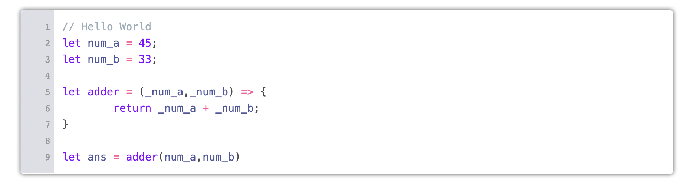

<p align="center">
  <br>
  <br>
    codecup: A micro code-editor for awesome web pages.<br>
    (Originally A Fork of <a href="https://github.com/kazzkiq/CodeFlask">CodeFlask</a>)
</p>

<p align="center">
  
</p>

## Why?
CodeFlask was a brilliant project, but seems to be unmaintained, and it required some significant updates to work with a new project I am working on.

### Kitchen Sink Example

```js
cup = new codecup('#cf_holder', { 
    language: "javascript",
    lineNumbers: true ,
    copyButton: true,
    maxLines : 15,
    minLines : 5
});
```


### Changes
* Added max line number option
* Switched from rollup to webpack
* Added example folder 
* disabled e2e tests 
* Small theme tweaks (Border, rounded corners.)
* updateded all codeflask references to codecup - 13/11/2023

> [!IMPORTANT]
> Languages are now loaded async (via prismjs), so you can load any language you want, without having to bundle them all. - Jan 2024

> [!NOTE]
> Languages supported are : [https://prismjs.com/#supported-languages](https://prismjs.com/#supported-languages)

### Core Changes as PR
> (Submitted as [PR](https://github.com/kazzkiq/CodeFlask/pull/134) to CodeFlask, incase it gets picked up again)
* Added support to destroy
* Added Linenumber add / remove 
* Added Linenumber toggle
* Added Readonly toggle

---

## Installation

You can install codecup via npm:

```
npm i @calumk/codecup
```

Or use it directly in browser via cdn service:

```
https://cdn.jsdelivr.net/npm/@calumk/codecup
```

## Usage

```js
import codecup from '@calumk/codecup';

const cup = new codecup('#my-selector', { language: 'js' });
```
You can also pass a DOM element instead of a selector:
```js
import codecup from 'codecup';

const editorElem = document.getElementById('editor');
const cup = new codecup(editorElem, { language: 'js' });
```
Usage with Shadow DOM:
```js
import codecup from 'codecup';
...
const shadowElem = this.shadowRoot.querySelector('#editor');
const cup = new codecup(shadowElem, { language: 'js', styleParent: this.shadowRoot });
```
### Listening for changes in editor

```js
cup.onUpdate((code) => {
  // do something with code here.
  // this will trigger whenever the code
  // in the editor changes.
});
```

### Updating the editor programatically

```js
// This will also trigger .onUpdate()
cup.updateCode('const my_new_code_here = "Blabla"');
```

### Getting the current code from editor

```js
const code = cup.getCode();
```


### Copy Button

The copy button is now enabled by default, and will copy the code to the clipboard when clicked.

it can be disabled by passing `copyButton: false` in the options.

```js
const cup = new codecup('#my-selector', {
  language: 'javascript',
  copyButton: false
});
```


### Enabling line numbers

```js
import codecup from 'codecup';

const cup = new codecup('#my-selector', {
  language: 'js',
  lineNumbers: true
});
```

You can also toggle line numbers after the editor is created:

```js
cup.toggleLineNumbers();

```

### Setting max and min lines

```js
> [!IMPORTANT]
> As of `1.90`, You can also set the max line number, (Default is 100), And the min line number, (Default is 1)

> [!NOTE]
> If you want it to be a fixed number of lines, set both to the same number.

```js
import codecup from 'codecup';

const cup = new codecup('#my-selector', {
  language: 'js',
  lineNumbers: true,
  maxLines: 10,
  minLines: 10
});
```


### Enabling read only mode

```js
import codecup from 'codecup';

const cup = new codecup('#my-selector', {
  language: 'javascript',
  readonly: true
});
```

### changing other languages support:

```js
cup.updateLanguage('ruby')
// 
cup.updateLanguage('javascript')
//
```

#### For Example to add change dynamically from 'Ruby' to 'javascript'

```js
import Prism from 'prismjs';
import codecup from 'codecup';

const cup = new codecup('#my-selector', {
  language: 'ruby',
  readonly: true
});

cup.updateLanguage('javascript');
```
