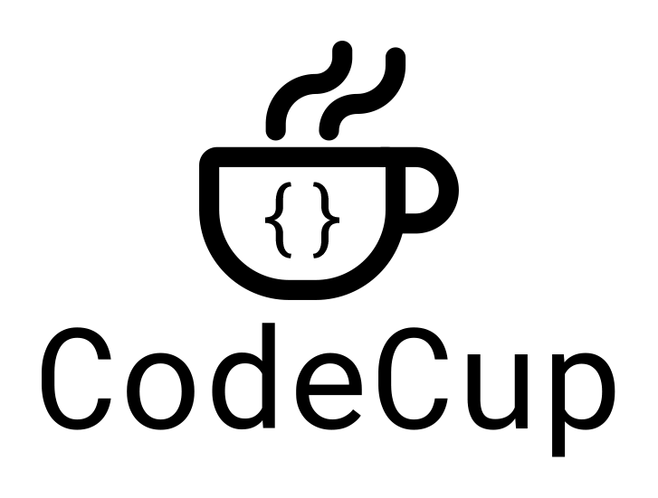

<p align="center">
  <br>
    CodeCup: A micro code-editor for awesome web pages.<br>
    A Fork of <a href="https://github.com/kazzkiq/CodeFlask">CodeFlask</a>
</p>

<p align="center">
  
</p>

## Why?
CodeFlask was a brilliant project, but seems to be unmaintained, and it required some significant updates to work with a new project I am working on.

> Yes - The new logo uses Comic Sans


## Changes
* Switched from rollup to webpack
* Added example folder 
* disabled e2e tests 
  * Required (Legacy deps - might rebuild)
* Small theme tweaks (Border, rounded corners.)

### Core Changes 
> (Submitted as [PR](https://github.com/kazzkiq/CodeFlask/pull/134) to CodeFlask, incase it gets picked up again)
* Added support to destroy
* Added Linenumber add / remove 
* Added Linenumber toggle
* Added Readonly toggle

---

## Installation

You can install CodeCup via npm:

```
todo
```

Or use it directly in browser via cdn service:

```
 todo
```

## Usage

```js
import CodeCup from 'codecup';

const flask = new CodeCup('#my-selector', { language: 'js' });
```
You can also pass a DOM element instead of a selector:
```js
import CodeCup from 'codecup';

const editorElem = document.getElementById('editor');
const flask = new CodeCup(editorElem, { language: 'js' });
```
Usage with Shadow DOM:
```js
import CodeCup from 'codecup';
...
const shadowElem = this.shadowRoot.querySelector('#editor');
const flask = new CodeCup(shadowElem, { language: 'js', styleParent: this.shadowRoot });
```
### Listening for changes in editor

```js
flask.onUpdate((code) => {
  // do something with code here.
  // this will trigger whenever the code
  // in the editor changes.
});
```

### Updating the editor programatically

```js
// This will also trigger .onUpdate()
flask.updateCode('const my_new_code_here = "Blabla"');
```

### Getting the current code from editor

```js
const code = flask.getCode();
```

### Enabling line numbers

```js
import CodeCup from 'codecup';

const cup = new CodeCup('#my-selector', {
  language: 'js',
  lineNumbers: true
});
```

### Enabling rtl (right to left writing)

```js
import CodeCup from 'codecup';

const cup = new CodeCup('#my-selector', {
  language: 'js',
  rtl: true
});
```

### Enabling read only mode

```js
import CodeCup from 'codecup';

const cup = new CodeCup('#my-selector', {
  language: 'js',
  readonly: true
});
```

### Adding other languages support:

```js
cup.addLanguage('ruby', options)
```

#### For Example to add 'Ruby'

```js
import Prism from 'prismjs';
import CodeCup from 'codecup';

const cup = new CodeCup('#my-selector', {
  language: 'ruby',
  readonly: true
});

cup.addLanguage('ruby', Prism.languages['ruby']);
```

This API is simply a proxy to add a new language to [Prism](http://prismjs.com/) itself (the code highlighter). The `options` parameter must be the same accepted in Prism. You can read more about it [here](http://prismjs.com/extending.html#language-definitions).

By default, CodeCup supports the following languages (which are also the default supported in Prism):

- Markup (HTML/XML);
- CSS;
- C-like;
- JavaScript;

### Adding your own theme to CodeCup

By default, CodeCup comes with a simple theme made from scratch called **[CodeNoon](https://github.com/kazzkiq/CodeCup.js/blob/master/src/styles/theme-default.js)**.

You can easily override this theme with your own by writting your own CSS and adding it to your project. If that's the case, you should also disable **CodeNoon** with the `defaultTheme` option:

```js
import CodeCup from 'codecup';

const cup = new CodeCup('#my-selector', {
  language: 'js',
  defaultTheme: false
});
```

# Credits & Thanks

CodeCup.js was made possible by awesome open-source projects such as [Prism.js](https://github.com/PrismJS/prism) and [Webpack](https://github.com/webpack).
